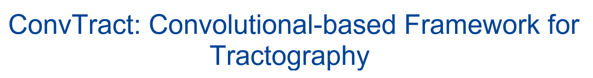
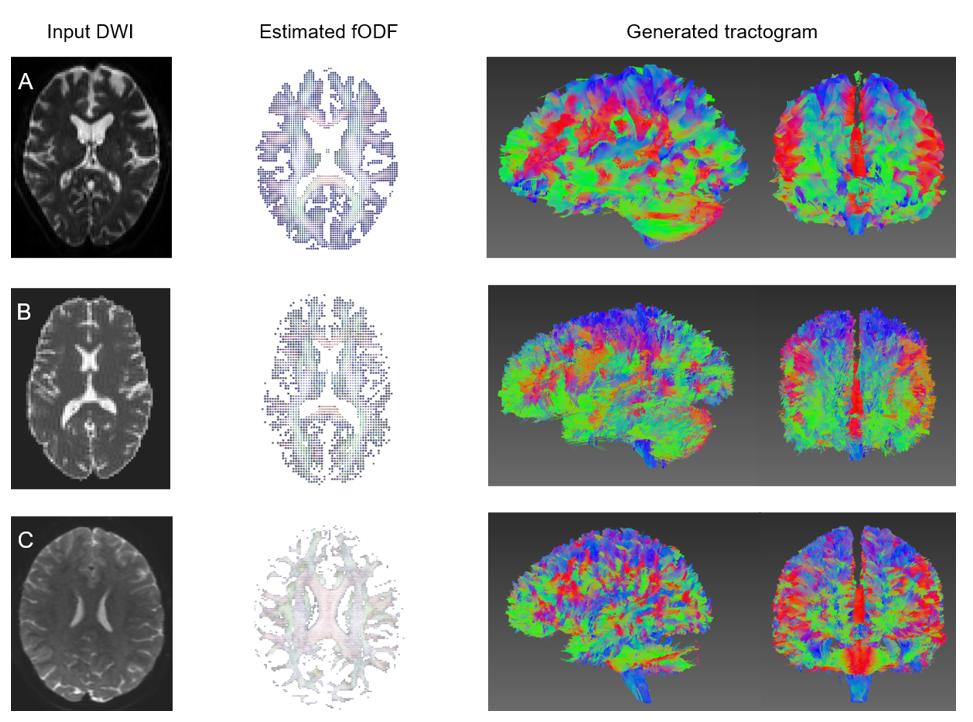

# CTtrack: A CNN+Transformer-based framework for fiber orientation estimation \& tractography 
<!-- PROJECT LOGO 
<br />
<p align="center">
    
</p>
-->

<!-- TABLE OF CONTENTS -->
<details open="open">
  <summary>Table of Contents</summary>
  <ol>
    <li><a href="#convtract">Approach</a></li>
    <li><a href="#how-to-use">How to use</a></li>
    <li><a href="#results">Results</a></li>
    <li><a href="#license">License</a></li>
    <li><a href="#citation">Citation</a></li>
    <li><a href="#contact">Contact</a></li>
  </ol>
</details>


<!-- ABOUT THE PROJECT -->
## Approach

We introduce a Convoulutional + Transformer-based framework for fiber orientation distribution function (fODF) estimation and automatic fiber tractography. The proposed model estimates fODFs using diffusion values in a local block around each voxel, taking into account the spatial information in the area.


## How to use
Here we provide a simple example for training and tracking.
### training
 ```sh
python3 convtract.py 'train' sample-data/dwi/ -labels sample-data/sh.nii.gz -bm sample-data/bm.nii.gz -wm sample-data/wm.nii.gz -save_dir ./
 ```
### tracking
 ```sh
python3 convtract.py 'track' sample-data/dwi/ -bm sample-data/bm.nii.gz -wm sample-data/wm.nii.gz -trained_model_dir AOT.ckpt 
```

Refer to _[help.txt](help.txt)_ for more details.


<!-- EXPERIMENTS -->
## Results

We tested our program on differents DWI data and confirmed that our pipeline performs high quality tractography.
<p align="center">
    
</p>


<!-- LICENSE -->
## License

Distributed under the MIT License. See `LICENSE` for more information.


<!-- CITATION -->
## Citation
If you use CTtrack in your research or wish to refer to this approach, please use the following BibTeX entry.
 ```sh
@article{HOSSEINI2022100099,
title = {CTtrack: A CNN+Transformer-based framework for fiber orientation estimation \& tractography},
journal = {Neuroscience Informatics},
year = {2022},
}
```

<!-- CONTACT -->
## Contact

S.M.H. Hosseiny - [@twitter](https://twitter.com/sotospeakk?s=09) - hosseiny290@gmail.com


